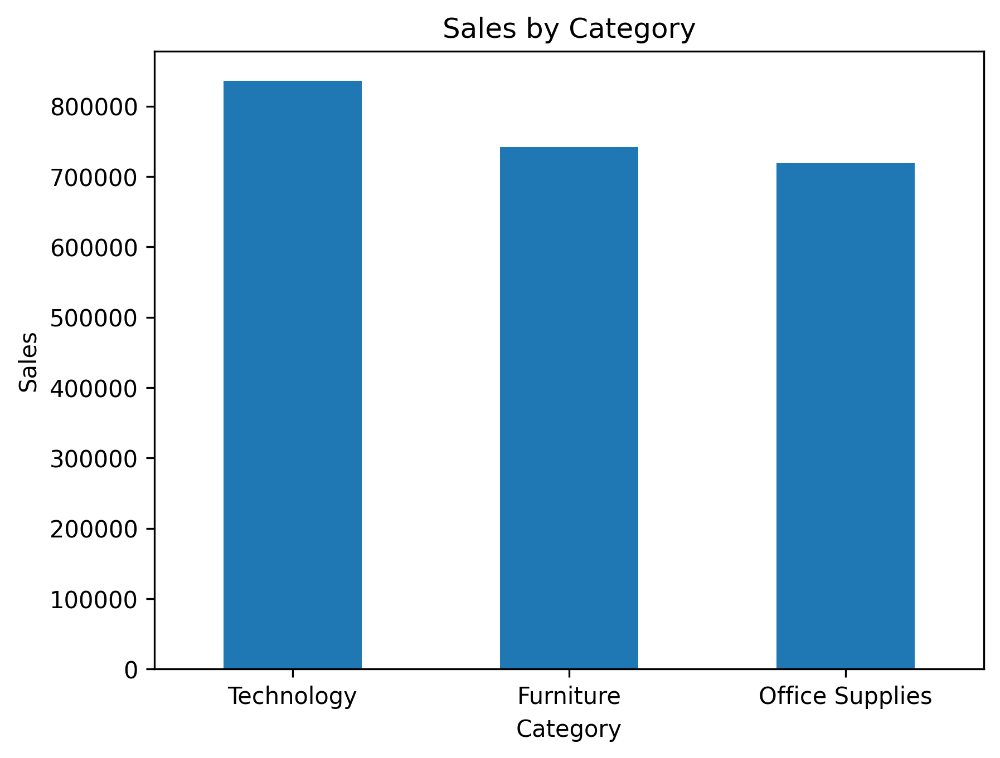
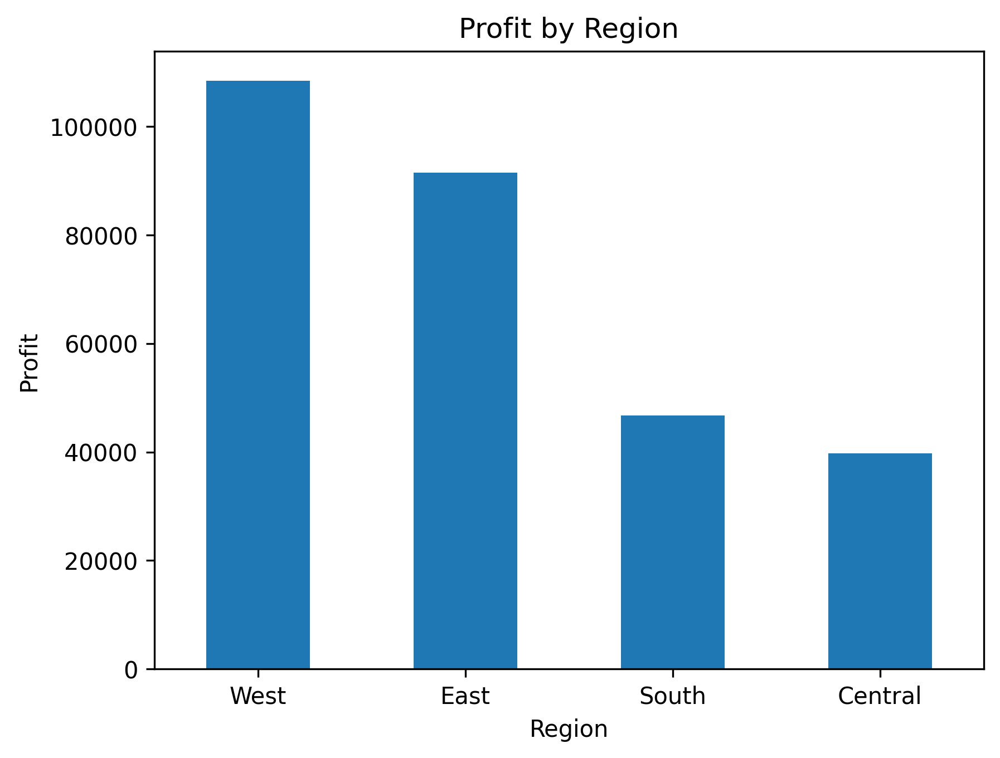
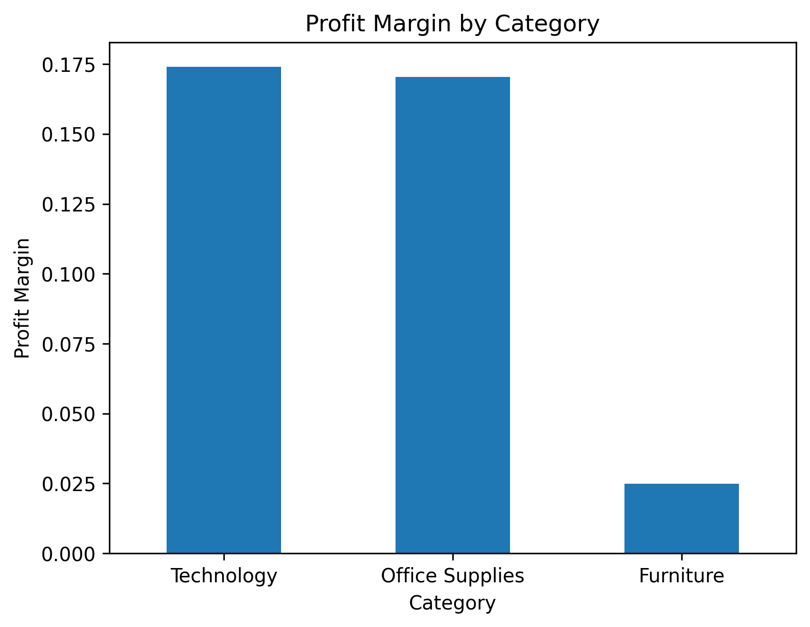
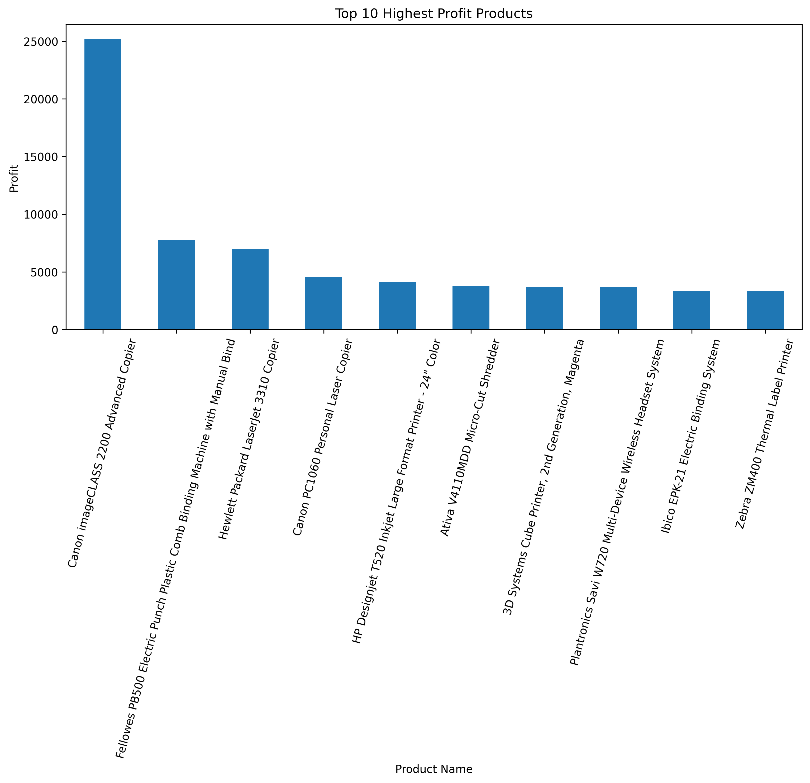

# 📊 Sales Performance Analysis using Python


## Project Overview

This project analyzes the Superstore Sales dataset using Python to identify sales trends, profitability, discount patterns, and business performance across product categories and regions.

The objective is to demonstrate Exploratory Data Analysis (EDA) skills and generate business insights that support data-driven decision making.

---

## Project Preview

### Sales by Category



### Profit by Region



### Profit Margin by Category



### Top 10 Highest Profit Products



---

## Dataset

- Dataset: Sample Superstore
- Source: Kaggle (public dataset)
- Records: 9,994
- Features: 21 columns

---

## Tools Used

- Python
- Pandas
- Matplotlib
- Google Colab

---

## Project Workflow

1. Data Loading
2. Data Cleaning
3. Exploratory Data Analysis (EDA)
4. Business Insight Generation
5. Strategic Recommendations

---

## Analysis Performed

### Sales Analysis
- Total Sales by Category
- Total Sales by Region
- Total Sales by Year
- Total Sales by Month

### Profit Analysis
- Total Profit by Category
- Total Profit by Region
- Total Profit by Year
- Profit Margin by Category

### Discount Analysis
- Average Discount by Category

### Product Performance
- Top 10 Highest Profit Products
- Top 10 Lowest Profit Products

---

## Key Findings

- Technology generated the highest sales and profit.
- Furniture recorded the highest average discount and the lowest profit margin.
- West Region achieved the highest sales and profit.
- South and Central Regions showed relatively lower profitability.
- Several products generated negative profit despite relatively high sales, indicating potential pricing or discount strategy issues.

---

## Business Recommendations

- Maintain the strong performance of the Technology category.
- Review discount policies, especially for Furniture products.
- Investigate the factors affecting profitability in the South and Central regions.
- Evaluate low-performing products with negative profit and optimize pricing strategies.

---

## Repository Structure

```
sales-performance-analysis-python/
│
├── Sales_Performance_Analysis.ipynb
├── Superstore.csv
├── images/
└── README.md
```

---

## Author

**Ida Ayu Gede Basma Pujanti**

Mathematics Graduate | Aspiring Data Analyst

LinkedIn:
https://www.linkedin.com/in/basmapujanti/

GitHub:
https://github.com/basmapujanti
